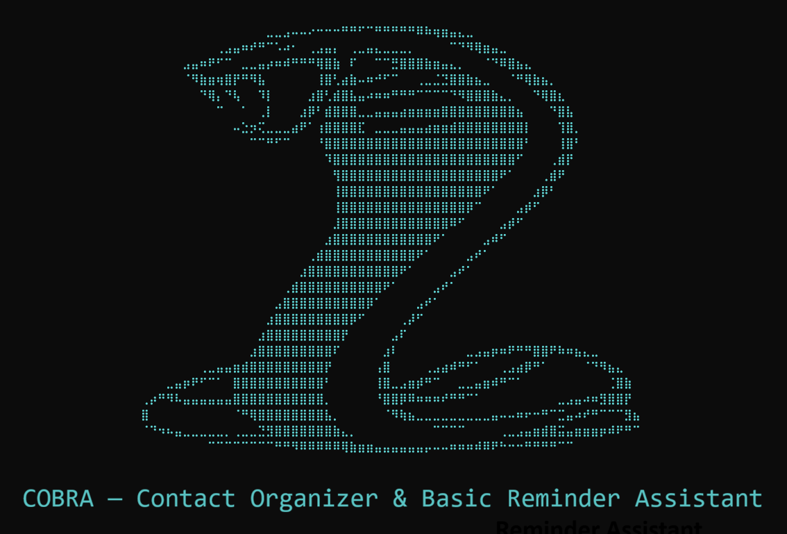
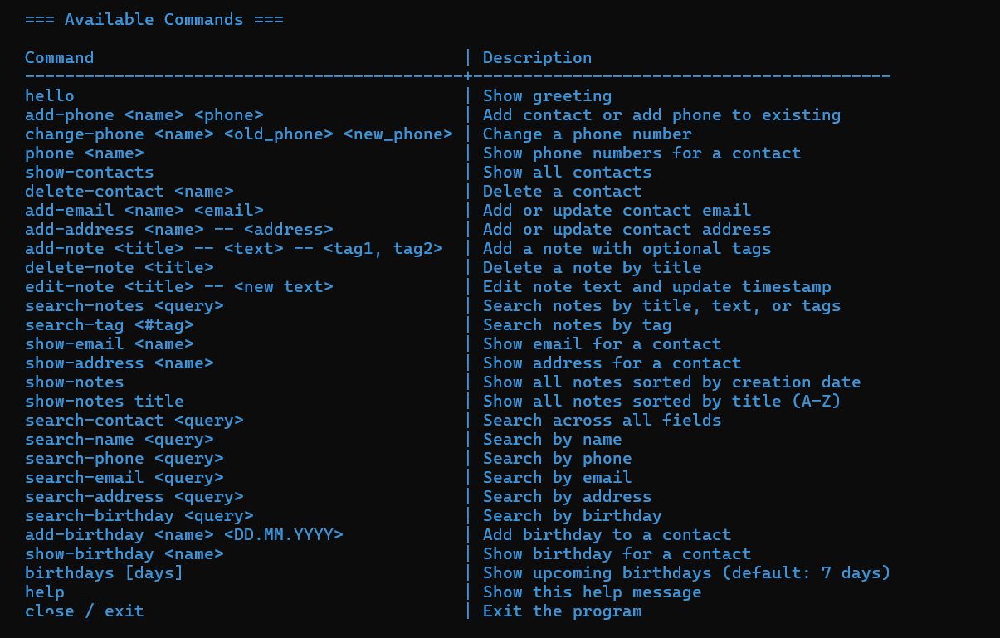
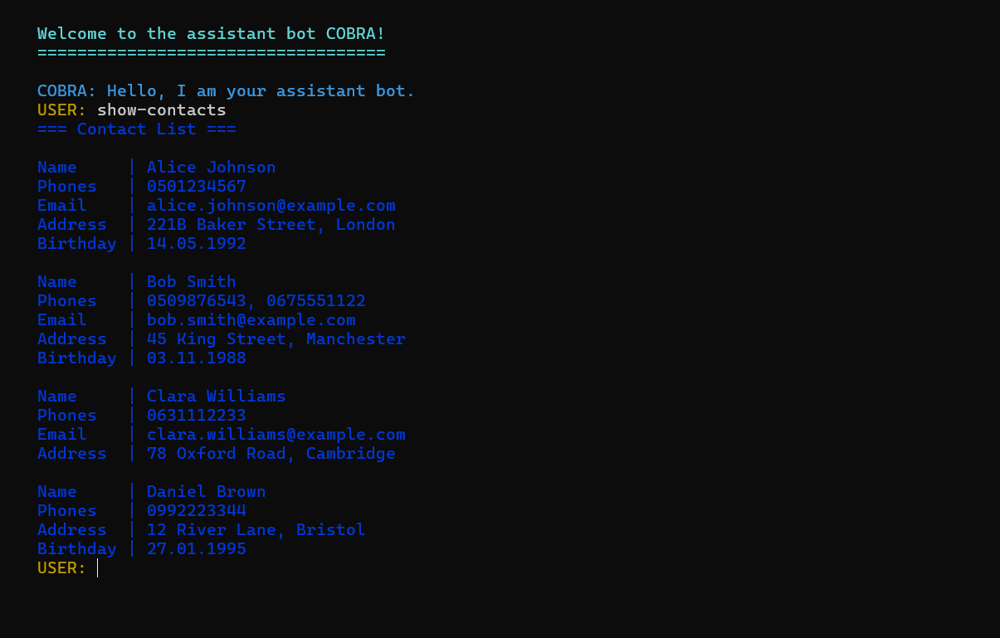
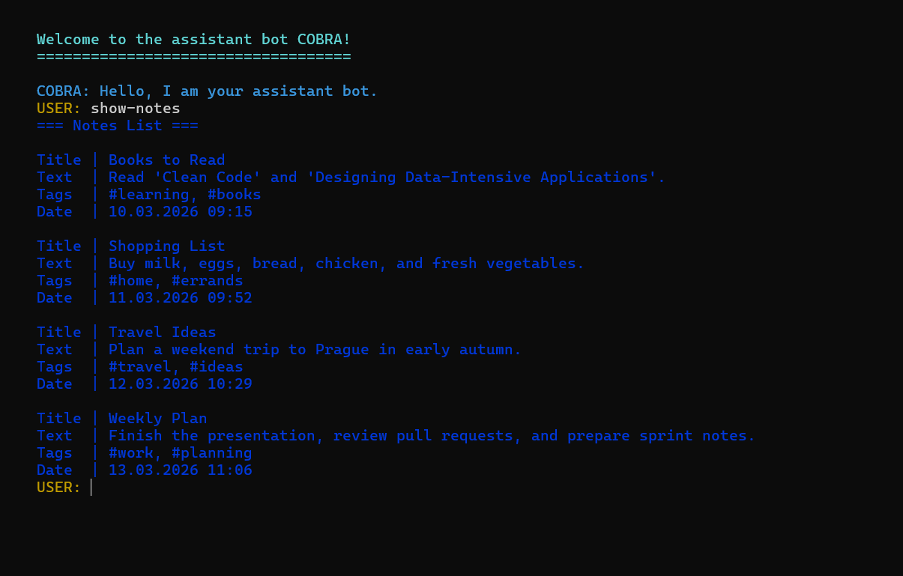
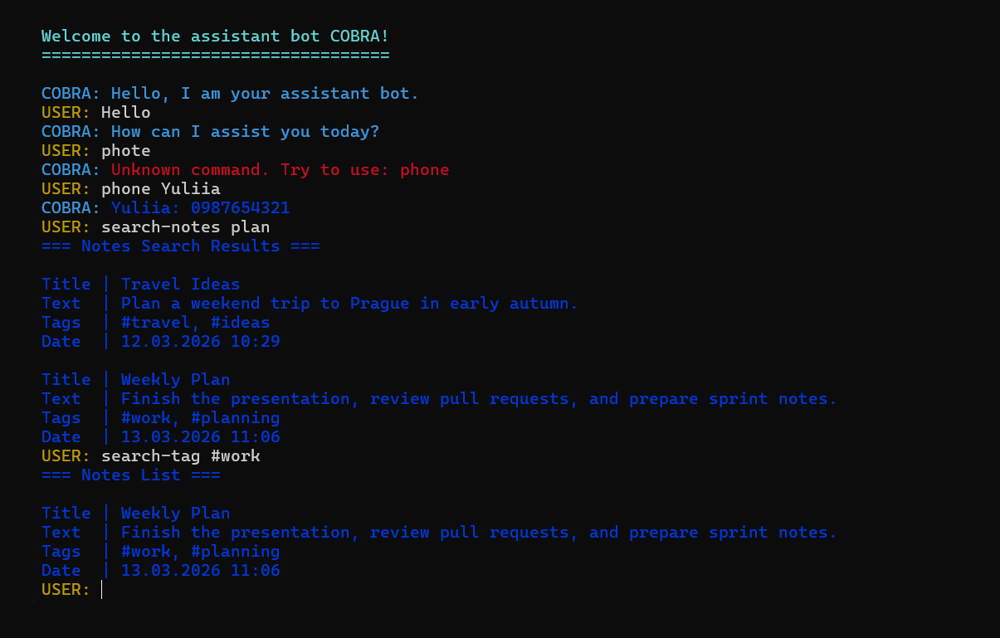

<p align="center">
	
</p>

# COBRA 𓆘 — Contact Organizer & Basic Reminder Assistant

COBRA is a command-line assistant for managing contacts and notes in one place.
It combines clear CLI commands, OOP-based domain models, and persistent storage via pickle
(auto-load on start, auto-save on exit).

## 🚀 Quick Start

### 1. Create Virtual Environment

Optional on Windows if you use `run-cobra.cmd` or `run-cobra.ps1`: both scripts can create `.venv` automatically on first run.

```cmd
python -m venv .venv
```

### 2. Activate Virtual Environment

**Windows (cmd or PowerShell):**

```cmd
.venv\Scripts\activate
```

**Mac/Linux:**

```bash
source .venv/bin/activate
```

### 3. Install Dependencies

```cmd
pip install -r requirements.txt
```

### 4. Install Local CLI Command

```cmd
pip install -e .
```

### 5. Run the CLI Bot

```cmd
cobra
```

```bash
cobra
```

Legacy command (also supported):

```cmd
python -m app.main
```

**Windows shortcut (without manual activation):**

Recommended: double-click `run-cobra.cmd` in File Explorer.

```powershell
.\run-cobra.ps1
```

```cmd
run-cobra.cmd
```

### 5.1 How to run `run-cobra.cmd` (Windows)

Use this if you want the easiest start command on Windows.

Option A (by click):

1. Open the project folder in File Explorer.
2. Double-click `run-cobra.cmd`.

Option B (from terminal):

1. Open **Command Prompt**.
2. Go to the project folder:

```cmd
cd D:\Neoversity\Hometasks\project-CobraCoders02
```

3. Run:

```cmd
run-cobra.cmd
```

What this script does automatically:

- creates `.venv` automatically if it does not exist yet;
- if `cobra` is not installed yet, runs `pip install -e .` inside `.venv`;
- starts the bot.

Requirement: Python 3.12+ must be installed and available as `py` or `python` in `PATH`.

To exit the bot, type:

```text
exit
```

PowerShell alternative:

```powershell
.\run-cobra.cmd
```

## 📌 Overview

COBRA is a CLI assistant for contact and notes management.

Implemented features:

- Contact CRUD with validation (name, phone, email, address, birthday)
- Notes with title/text/tags support and duplicate-title protection
- Notes search by text and by tag (`search-tag`)
- Optional notes sorting by title (`show-notes title`)
- Friendly error handling and command suggestions for typos
- Persistent storage in `addressbook.pkl` and `notes.pkl`

## 🧰 Technologies & Key Features

**Technologies used (external/runtime):**

- Python 3.12+
- colorama (colored CLI output)

**Python standard library modules used:**

- difflib
- shlex
- re
- pickle
- datetime
- collections
- functools
- typing
- uuid

**Architecture and implementation highlights:**

- Modular structure: handlers, models, decorators, validators, storage, messages
- OOP domain models for contacts and notes (`AddressBook`, `Record`, `NotesBook`, `Note`)
- Decorator pipeline for handlers (`validate_args`, `input_error`, `colored_output`)
- Unified message layer via centralized constants and formatting helpers
- Graceful error handling with user-friendly responses instead of crashes
- Command typo suggestions (closest match for unknown commands)
- Normalization and validation for phone, email, address, birthday, note fields, and tags
- Notes capabilities: duplicate title prevention, full-text search, tag search, sorting by title
- Data persistence with load-on-start and save-on-exit behavior

## 🧭 Available Commands

### 🛠 General

- `hello`
- `help`
- `close` / `exit`

### 👥 Contacts

- `add-phone <name> <phone>`
- `change-phone <name> <old_phone> <new_phone>`
- `phone <name>`
- `show-contacts`
- `delete-contact <name>`
- `add-email <name> <email>`
- `show-email <name>`
- `add-address <name> -- <address>`
- `show-address <name>`
- `search-contact <query>`
- `search-name <query>`
- `search-phone <query>`
- `search-email <query>`
- `search-address <query>`
- `add-birthday <name> <DD.MM.YYYY>`
- `show-birthday <name>`
- `search-birthday <query>`
- `birthdays [days]`

### 📝 Notes

- `add-note <title> -- <text> -- <tag1, tag2>`
- `show-notes`
- `show-notes title`
- `search-notes <query>`
- `search-tag <#tag>`
- `edit-note <title> -- <new text>`
- `delete-note <title>`

## 💡 Examples

```cmd
cobra

REM Contacts
add-phone John Doe 0501234567
add-email John Doe john@example.com
add-address John Doe -- 12 Main Street, London
show-contacts
search-contact john

REM Notes
add-note Weekly plan -- Finish report and call client -- work, urgent
add-note Ideas -- Discuss #roadmap with team
show-notes
show-notes title
search-notes report
search-tag #work
```

## 🖼 Screenshots

### Commands table



### Contacts list



### Notes list



### Bot interaction



## ✅ Validation Notes

- Phone accepts local formats like `0501234567`, `050-123-4567`, `(050)123-4567`, then normalizes and stores them in one format: `0501234567`.
- `add-address` and note-editing commands use `--` as a required separator.
- `search-tag` expects a hashtag format (for example `#work`).
- `show-notes` accepts only one optional sort argument: `title`.

## 💾 Persistence

- Contacts are loaded/saved via `addressbook.pkl`.
- Notes are loaded/saved via `notes.pkl`.
- Data is loaded on app start and saved on app exit.

## 🗂 Project Structure

```
project-CobraCoders02/
├── app/
│   ├── handlers/              # Command handlers
│   ├── decorators/            # Decorators for validation/errors/output
│   ├── models/                # AddressBook/Notes domain models
│   ├── input_parser.py        # Command parsing
│   ├── main.py                # CLI entry point
│   ├── message_texts.py       # Centralized text constants
│   ├── messages.py            # Formatted message builders
│   ├── storage.py             # Pickle persistence
│   └── validators.py          # Input validators
├── pyproject.toml
├── requirements.txt
├── run-cobra.cmd
├── run-cobra.ps1
└── README.md
```
